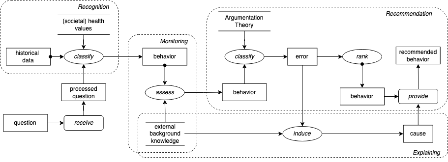

# Scenario 1 Task Decomposition

## Title 
Detecting conflicting, non-cooperative Smart Watch Assistants.

## Description 
This scenario involves smart assistants for improving personal health. An artificial agent provides behavior recommendations to users asking questions regarding daily diet and exercise schedule. The aim is to detect and explain deceptive behaviors such as lies about one's own activity from data errors due to external conditions (e.g. available resources, varying environmental conditions).  Argumentation Theory is used to detect errors and conflicts through reasoning over the users' prior knowledge in the form of a knowledge graph.

## Visual Task Decomposition

## Terminology 
(dynamic) user questions, behaviors, errors, causes, historical user
data. (static) societal health values, external background knowledge.

## Inference Steps:
1. receive question from a user;
2. classify a user behavior based on questions, historical data, and societal values;
3. assess the user behaviors;
4. classify a deceptive behavior as an error using Argumentation Theory;
5. induce the causes for an error;
6. rank the classified behaviors ;
7. provide the recommended behavior based on the detected cause.

## Tasks 
Recognition (1-2), Monitoring (3), Explaining (5), Recommendation (4-7).
