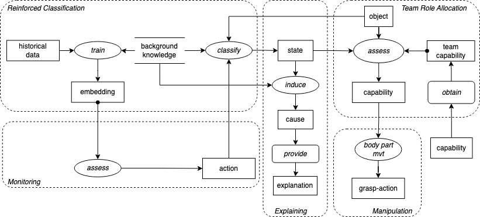

# Scenario 2 Task Decomposition

## Title 
Learning Explainable Sequential Behaviors.

## Description 
 An embodied mobile agent and a human collaborator perform manipulation tasks involving a complex sequence of steps , e.g. unlocking and opening a cabinet before retrieving a tool. Actions such as  lifting a heavy object can be performed only by the robot, while others  such as inserting a key into a small lock only by humans. Using Reinforcement Learning ,  the agent learns the optimal sequential behavior without the exact problem description as in classical planning. Knowledge Graphs are used as prior knowledge to learn low-level policies  in the abstract transition graph, in order to track the agent’s state and explain  dangerous states to the collaborator.
 
## Visual Task Decomposition

## Terminology 
(dynamic) object, capabilities, actions, causes, explanations, states.
(static) background knowledge (Knowledge Graph)

## Inference Steps:
1. train a model based on the background and some historical action data;
2. assess the agent’s actions to identify the optimal one;
3. classify the agent’s state as dangerous or not;
4. induce the dangerous states and
5. provide them to the users;
6. obtain the other agents’ capabilities;
7. assess the other agent’s capabilities;
8. move body part to perform the grasping action accordingly.

## Tasks 
Classification (1-3), Explaining (4-5), Team Role Allocation (6-7), Manipulation (8)

