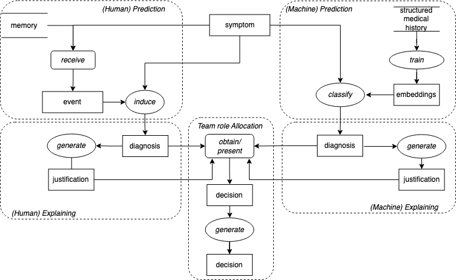

# Scenario 5 Task Decomposition

## Title 
Machine Intelligence with Knowledge Graphs.

## Description 
A hybrid
system generates diagnoses (Scenario) based on the patient’s symptoms and medical history stored in a Knowledge Graph. A human operator and an embeddings-based (ProcessingMethod) system (both Actors) with complementary scientific expertise (Capability) perform the prediction and justify their propositions to each other (InteractionTask) in order to come up with a final decision (EndGoal)

## Visual Task Decomposition

## Terminology 
(dynamic) symptoms, embeddings, historical medical events,
diagnoses, justifications, decisions. (static) human memory, medical KG

## Inference Steps:
1. (human) recollect similar events ;
2. (human) induce the diagnosis;
3. (machine) train and
4. (machine) classify diagnoses;
5. generate a justification for the diagnosis and
6. idem
7. present it to the other agent that can
8. idem
9. obtain the information;
10. ultimately, generate a combined decision.

## Tasks 
Prediction (1-4), Explaining (5-6), Team Role Allocation (7-10)

