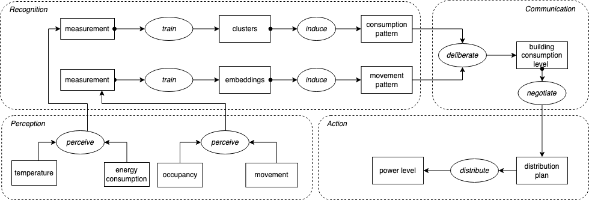

# Scenario 6 Co-learning Buildings

## Title 
Detecting conflicting, non-cooperative Smart Watch Assistants.

## Description 
A campus (Context) involves AIbased buildings (Actor) negotiating on power level for the heating system (EndGoal). They optimize their own energy consumption, take into account the energy needs of others when moving between different buildings, and also interact with human grid operators accounting for the preferences of building owners. The agents learn (ProcessingMethod) occupancy-movement patterns and building energy consumption behavior in a collaborative co-learning setting (InteractionMethod), where the learned models are negotiated in order to deliberate on a power distribution plan

## Visual Task Decomposition

## Terminology 
 (dynamic) temperature/occupancy/energy consumption measurements, clusters, embeddings, movement and consumption patterns, consumption
models, distribution plans

## Inference Steps:
1. perceive occupancy and movement data from sensors;
2. perceive energy consumption and temperature data from sensors;
3. train&induce energy consumption and occupancy-movement patterns based
on the measurements;
4. - 
5. - 
6. - 
7. deliberate the building consumption model to the other agents;
8. negotiate on a distribution plan;
9. distribute the power level to the campus

## Tasks 
Perception (1-2), Recognition (3–6), Communication (7-8), Action (9).
